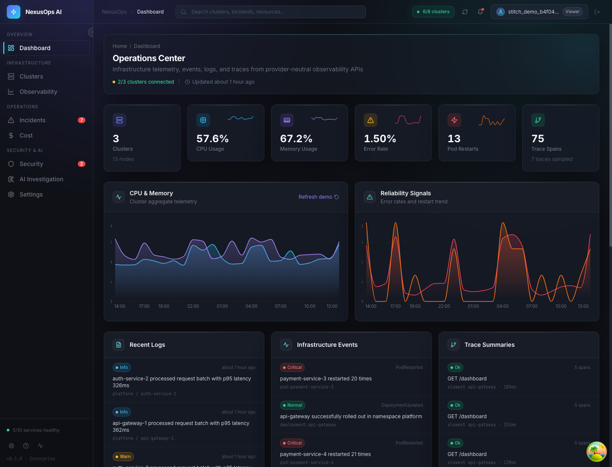
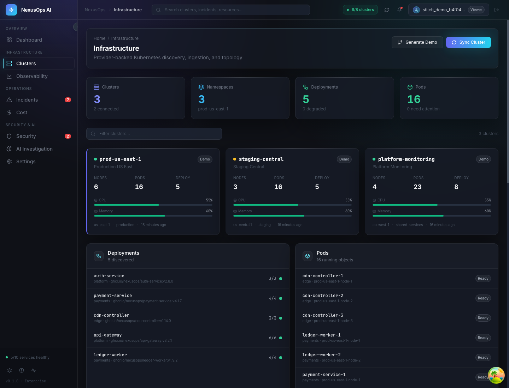
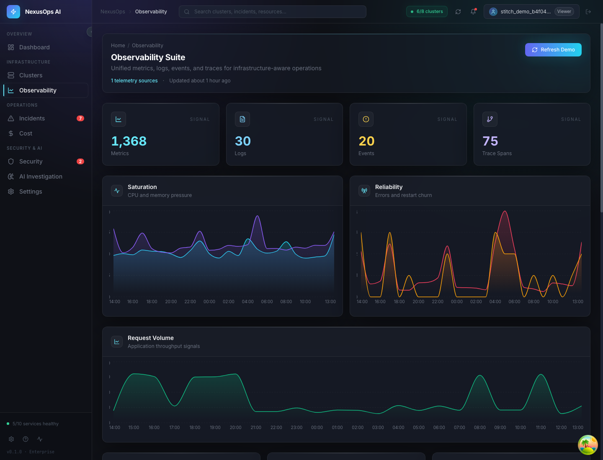
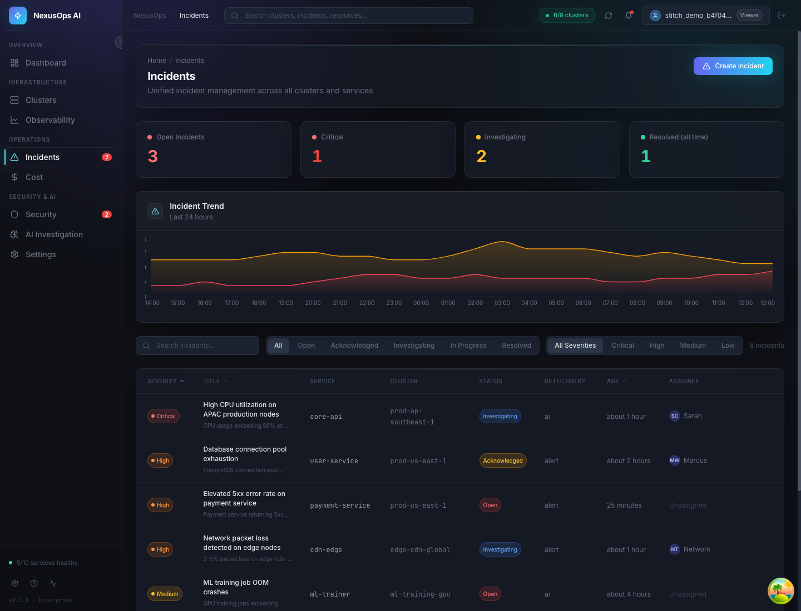
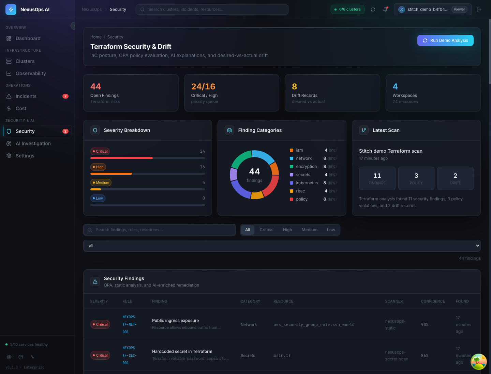
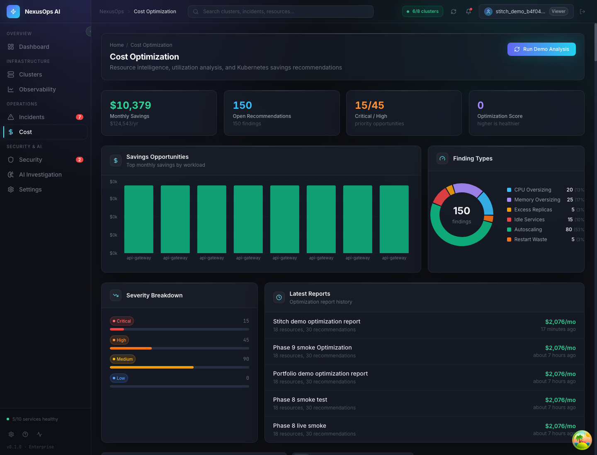
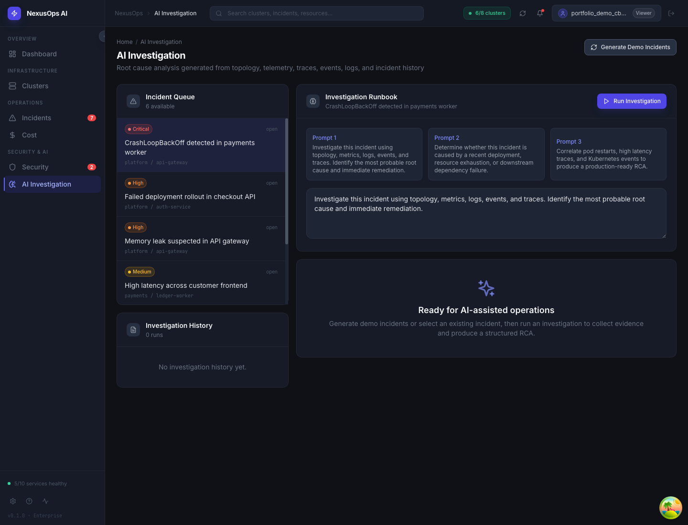
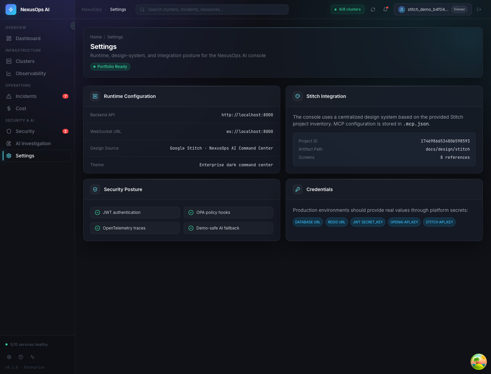

# NexusOps AI

> Enterprise AI-powered cloud operations, infrastructure intelligence, and platform engineering showcase.

[](LICENSE)
[](https://python.org)
[](https://fastapi.tiangolo.com)
[](https://react.dev)
[](https://docker.com)
[](https://kubernetes.io)

NexusOps AI is a portfolio-grade AIOps and infrastructure intelligence platform for teams operating Kubernetes, Terraform, telemetry pipelines, and incident response workflows. It is intentionally built to resemble real cloud platform software rather than a CRUD application: provider abstractions, typed APIs, service/repository boundaries, asynchronous background work, observability, policy evaluation, AI-assisted investigation, and deployment automation all live in one cohesive monorepo.

The project demonstrates the kind of engineering expected in cloud backend, platform engineering, SRE, infrastructure, and AIOps roles.

## Problem Statement

Modern platform teams often operate across disconnected systems: Kubernetes inventories, telemetry tools, Terraform state, cost data, security findings, incident records, and AI assistants that do not share context. This fragmentation slows root cause analysis, hides infrastructure drift, makes cost waste hard to explain, and weakens operational auditability.

NexusOps AI solves this by normalizing infrastructure, telemetry, security, incident, and cost data into a unified platform model that can be queried by APIs, rendered by dashboards, analyzed by deterministic services, and enriched by AI providers.

## Design Principles

- **Provider-neutral ingestion:** Kubernetes, demo, telemetry, Terraform, and AI providers feed shared domain models so the frontend does not depend on data origin.
- **Typed enterprise APIs:** FastAPI and Pydantic schemas define explicit contracts for infrastructure, incidents, telemetry, investigations, security, cost, and audit records.
- **Layered backend architecture:** API routes delegate to service and repository layers instead of embedding business logic in handlers.
- **Operational visibility first:** Logs, metrics, traces, correlation IDs, and health checks are treated as core platform behavior.
- **Secure-by-default posture:** JWT validation, role-based authorization, audit trails, secret hygiene, OPA policy evaluation, and CI scanning are part of the engineering story.
- **Demo without deception:** Demo providers generate realistic enterprise scenarios while exercising the same APIs and persistence paths as real integrations.

## Engineering Challenges Solved

| Challenge | NexusOps AI approach |
|---|---|
| Multi-source infrastructure discovery | Provider abstraction for Kubernetes, local clusters, and demo infrastructure |
| Topology reconstruction | Relational models for clusters, namespaces, deployments, pods, services, and nodes |
| Telemetry normalization | Persistent metrics, logs, events, traces, and source metadata linked to resources |
| AI incident analysis | Context builder, evidence collector, remediation engine, and LLM provider abstraction |
| Terraform risk and drift | Parser, deterministic security rules, OPA integration, drift records, and AI explanations |
| Cost intelligence | Utilization analysis, optimization rules, estimated savings, reports, and recommendations |
| Enterprise auditability | Audit event model, service/repository layer, admin API, and security event logging |
| Deployment validation | Docker, Compose, CI quality gates, migration checks, frontend builds, and smoke tests |

## Capability Matrix

| Capability | Status | Key implementation areas |
|---|---:|---|
| Kubernetes discovery | Implemented | `backend/app/infrastructure`, `backend/app/services`, infrastructure APIs |
| Demo infrastructure mode | Implemented | Demo provider and shared persistence model |
| Observability platform | Implemented | Metrics, logs, events, traces, OpenTelemetry, Prometheus, Loki |
| AI incident investigation | Implemented | Context/evidence pipeline, RAG, OpenAI/Ollama abstraction, deterministic fallback |
| Terraform security and drift | Implemented | Terraform parser, OPA policies, findings, drift, scan history |
| Cost optimization | Implemented | Utilization analysis, findings, reports, recommendations |
| Enterprise dashboard | Implemented | React, TypeScript, React Query, Zustand, Stitch-inspired design system |
| RBAC and audit trail | Implemented | Viewer, Operator, Security Analyst, Administrator, audit APIs |
| Production hardening | In progress | Dependency scanning, security docs, scalability guidance, deployment reviews |

## Enterprise Features

- Infrastructure inventory and topology across real and demo providers.
- Telemetry history for CPU, memory, restarts, error rates, logs, events, and traces.
- Incident investigation workflows with persisted findings, evidence, confidence, and remediation.
- Terraform security findings, policy violations, drift detection, and explainability.
- Cost optimization recommendations with severity, savings estimates, and report history.
- Role-based access control for read, operate, security analysis, and administration workflows.
- Audit trail for authentication, demo generation, investigations, security scans, Terraform analysis, and cost analysis.
- OpenAPI documentation, structured schemas, migrations, and CI quality gates.

## Architecture

```text
Frontend (React + TypeScript)
  Dashboard, topology, observability, incidents, security, cost, AI investigation
        |
        v
FastAPI API Layer
  Auth, RBAC, OpenAPI schemas, request validation, correlation IDs
        |
        v
Service Layer
  Discovery, telemetry, investigation, Terraform, optimization, audit
        |
        v
Repository + Persistence Layer
  PostgreSQL, Redis, Qdrant, Alembic migrations
        |
        v
Provider + Integration Layer
  Kubernetes, demo providers, OpenTelemetry, Prometheus, OPA, OpenAI, Ollama
```

See [Architecture Overview](docs/architecture.md), [Architecture Review](docs/architecture-review.md), and [ADRs](docs/adr/) for the detailed design rationale.

## Architecture Maturity

NexusOps AI is organized as a monorepo with clear ownership boundaries:

- `backend/app/api` owns HTTP contracts and dependency enforcement.
- `backend/app/services` owns business workflows and orchestration.
- `backend/app/repositories` owns query and persistence behavior.
- `backend/app/models` owns relational domain entities.
- `backend/app/schemas` owns typed request and response contracts.
- `frontend/src/services` owns API clients.
- `frontend/src/components` and `frontend/src/pages` own reusable UI and routed experiences.
- `infrastructure`, `kubernetes`, and `terraform` contain deployment and platform assets.

The architecture is intentionally modular enough to explain scaling paths without prematurely optimizing a portfolio project into a full SaaS product.

## Security

Security is treated as a platform concern rather than an afterthought:

- JWTs include issuer, audience, token type, expiry, and unique IDs.
- RBAC separates Viewer, Operator, Security Analyst, and Administrator responsibilities.
- Write and analysis endpoints require elevated roles.
- Audit events capture actor, action, timestamp, resource, request ID, IP address, user agent, and metadata.
- OPA evaluates policy rules for Terraform and infrastructure security scenarios.
- Secrets are managed through environment files locally and documented for production secret stores.
- CI includes linting, tests, migration validation, build validation, and security scanning hooks.

See [Threat Model](docs/security/threat-model.md), [Permissions Matrix](docs/security/permissions-matrix.md), and [Audit Trail](docs/security/audit-trail.md).

## Scalability

The current implementation is suitable for local demonstration and architecture review. The scaling design anticipates growth from 10 to 1000 clusters by separating ingestion, persistence, async processing, and retrieval concerns.

Key future scaling levers include worker partitioning, telemetry retention policies, database indexes and partitioning, Redis caching, vector collection lifecycle management, and provider-specific rate limits.

See [Scalability Review](docs/scalability.md).

## Screenshots

| Dashboard | Infrastructure |
|---|---|
|  |  |

| Observability | Incidents |
|---|---|
|  |  |

| Security | Cost Optimization |
|---|---|
|  |  |

| AI Investigation | Settings |
|---|---|
|  |  |

## Documentation

- [Deployment Guide](docs/deployment.md)
- [Developer Onboarding](docs/onboarding.md)
- [Testing Strategy](docs/testing.md)
- [Interview Guide](docs/interview-guide.md)
- [API Reference](docs/api.md)
- [Infrastructure Discovery](docs/infrastructure-discovery.md)
- [Observability & Telemetry](docs/observability-telemetry.md)
- [Observability Standards](docs/observability/README.md)
- [AI Investigation Engine](docs/ai-investigation-engine.md)
- [Terraform Security & Drift](docs/terraform-security-drift.md)
- [Cost Optimization & Resource Intelligence](docs/cost-optimization-resource-intelligence.md)
- [Demo Scenarios](docs/demo-scenarios.md)
- [Stitch Design System](docs/design/stitch/DESIGN.md)

## Roadmap

- Harden refresh-token lifecycle with persisted sessions, token family tracking, and revocation.
- Add production secret-store examples for Kubernetes and cloud deployments.
- Expand provider conformance tests for Kubernetes, telemetry, Terraform, and AI providers.
- Introduce telemetry retention policies and high-cardinality safeguards.
- Add release automation, SBOM publishing, and signed container artifacts.
- Expand multi-tenant authorization boundaries if the project evolves beyond portfolio scope.

## Validation

CI and local quality gates cover backend linting, migrations, tests, API smoke tests, frontend type checks, linting, tests, builds, Docker Compose validation, and production image builds. See [Testing Strategy](docs/testing.md) for the full validation model.

## License

MIT - see [LICENSE](LICENSE) for details.
