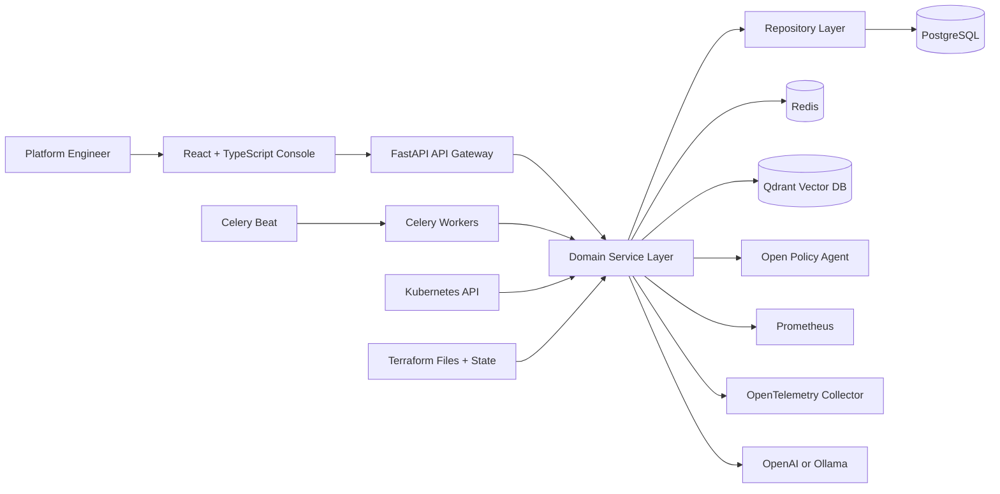
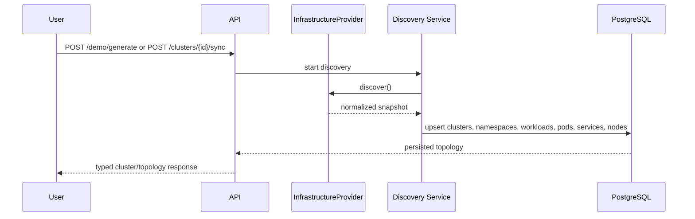
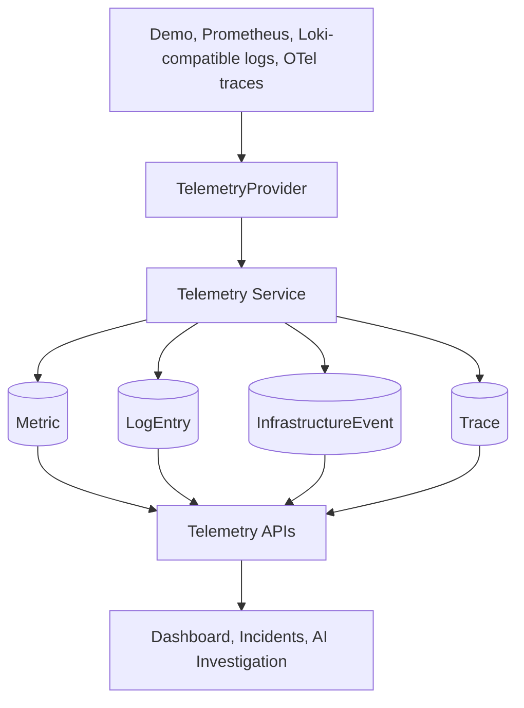
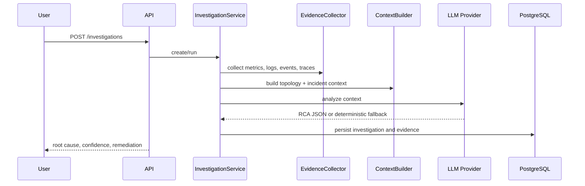
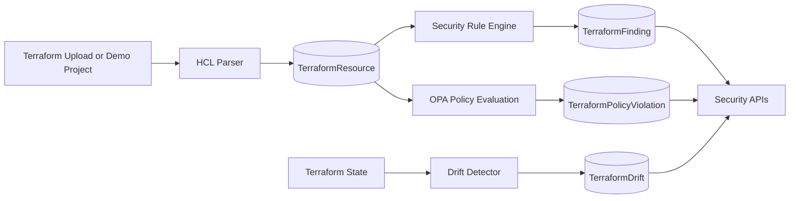
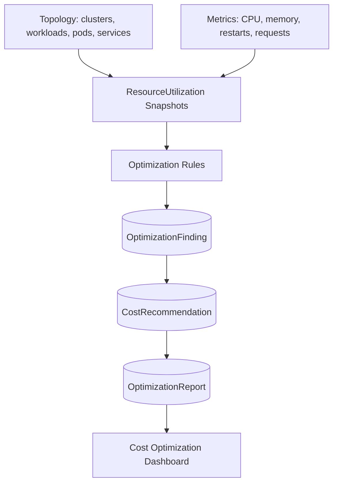

# NexusOps AI Architecture

This document summarizes the production-style architecture used by NexusOps AI and the major data flows that make the platform demonstrable without requiring external cloud credentials.

## System Architecture

## Infrastructure Discovery Flow

## Observability Flow

## AI Investigation Flow

## Terraform Analysis Flow

## Cost Optimization Flow

## Design Principles

- Providers normalize external and demo data into the same domain model.
- Services own business workflows; repositories own persistence access.
- APIs return typed Pydantic schemas and keep provider details hidden from the frontend.
- Deterministic fallbacks keep demos functional without OpenAI, Ollama, Kubernetes, or cloud credentials.
- Every incident, finding, recommendation, and telemetry signal remains linkable back to infrastructure resources.
