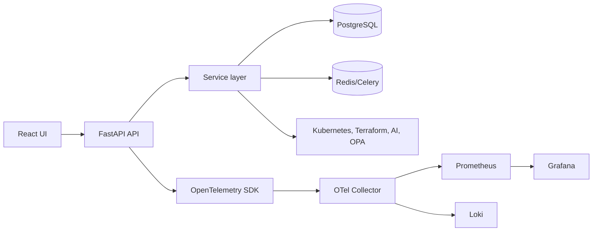

# Observability Standards

NexusOps AI treats observability as both a platform feature and an engineering quality requirement. The application collects and displays telemetry, but it also instruments itself so operators can understand API health, worker behavior, and provider integrations.

## Observability Flow



## Correlation IDs

Requests should carry a correlation ID through:

- HTTP request headers.
- Structured logs.
- Audit events.
- Trace attributes.
- Worker task metadata where applicable.

Recommended header:

```text
X-Request-ID
```

If the client does not provide a request ID, middleware should generate one and include it in response headers.

## Trace Propagation

Trace context should propagate across:

- Frontend API requests.
- FastAPI route handlers.
- Service and repository calls.
- Celery task dispatch and execution.
- External provider calls to Kubernetes, OPA, telemetry backends, and LLM APIs.

Recommended propagation format:

```text
traceparent
```

## Metrics Catalog

| Metric | Type | Purpose |
|---|---|---|
| `http_requests_total` | Counter | API request volume by method, route, and status. |
| `http_request_duration_seconds` | Histogram | API latency distribution. |
| `provider_sync_total` | Counter | Infrastructure and telemetry sync attempts by provider and status. |
| `provider_sync_duration_seconds` | Histogram | Sync latency by provider. |
| `celery_task_total` | Counter | Background task attempts by task and status. |
| `ai_investigation_total` | Counter | Investigation runs by provider and result. |
| `ai_investigation_duration_seconds` | Histogram | LLM and deterministic investigation latency. |
| `terraform_findings_total` | Gauge | Active Terraform findings by severity. |
| `optimization_estimated_savings` | Gauge | Estimated savings in the latest optimization report. |
| `audit_events_total` | Counter | Security-relevant actions by action and status. |

## Logging Standards

Logs should be structured and include:

- `timestamp`
- `level`
- `service`
- `request_id`
- `trace_id`
- `actor`
- `action`
- `resource_type`
- `resource_id`
- `status`
- `error`

Guidelines:

- Do not log secrets, tokens, API keys, kubeconfigs, or raw authorization headers.
- Prefer action-oriented log messages.
- Log failures with enough context to debug without exposing sensitive payloads.
- Use audit events for security accountability and logs for operational diagnosis.

## Alerting Recommendations

| Alert | Signal | Suggested threshold |
|---|---|---|
| API error rate | 5xx rate | Greater than 2 percent for 5 minutes |
| API latency | p95 duration | Greater than 1 second for 10 minutes |
| Worker backlog | Celery queue length | Sustained growth for 10 minutes |
| Provider sync failures | Sync failure rate | More than 3 consecutive failures per provider |
| Database saturation | Connection usage | Greater than 80 percent |
| AI provider failures | Investigation provider failures | Greater than 10 percent for 15 minutes |
| Audit anomaly | Sensitive action volume | Sudden spike above baseline |

## Future Improvements

- Add request ID middleware if absent from runtime paths.
- Export audit events to a SIEM-compatible sink.
- Add trace links from investigation results to supporting telemetry.
- Add high-cardinality guardrails for Kubernetes labels and telemetry dimensions.
