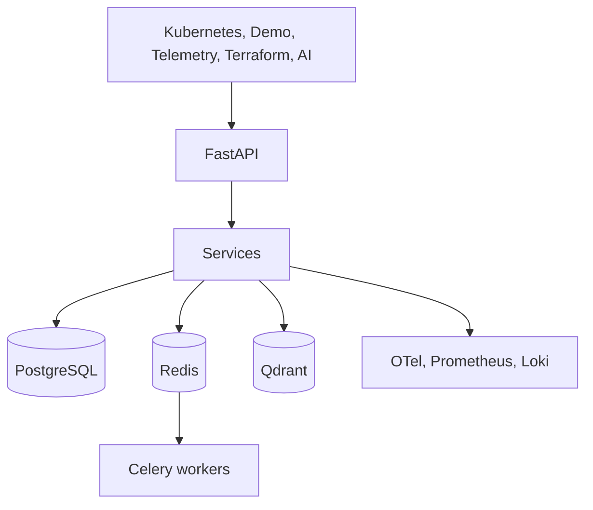

# Scalability Review

NexusOps AI is designed as a portfolio-grade platform with credible growth paths. This document explains likely bottlenecks and evolution options for 10, 100, and 1000 cluster scenarios without prematurely optimizing the current codebase.

## Baseline Architecture

## 10 Clusters

Expected behavior:

- Single API instance and a small Celery worker pool are sufficient.
- PostgreSQL handles topology, telemetry summaries, incidents, findings, and reports.
- Demo and real provider syncs can run on simple schedules.

Primary risks:

- Noisy telemetry if every pod emits high-frequency raw samples.
- Long-running syncs if provider calls are synchronous.

Recommended posture:

- Keep telemetry retention modest.
- Use indexes on cluster, namespace, deployment, pod, timestamp, and severity fields.
- Keep sync jobs idempotent.

## 100 Clusters

Expected behavior:

- Sync workloads should move primarily to Celery.
- API replicas should be horizontally scalable.
- Worker concurrency should be separated by workflow type.

Database bottlenecks:

- Telemetry history table growth.
- Query fan-out for dashboard aggregates.
- Audit and event volume growth.

Queue bottlenecks:

- Cluster sync jobs competing with AI investigations or Terraform scans.
- Retry storms during provider outages.

Cache opportunities:

- Cluster inventory summaries.
- Dashboard rollups.
- Topology trees.
- Recent telemetry windows.

Recommended evolution:

- Partition high-volume telemetry by time.
- Add materialized or cached dashboard summaries.
- Create dedicated queues for discovery, telemetry, AI, Terraform, and cost analysis.
- Add provider-level rate limits and exponential backoff.

## 1000 Clusters

Expected behavior:

- The platform becomes an ingestion and analytics system, not only an API app.
- Raw telemetry should be delegated to specialized stores.
- PostgreSQL should store normalized metadata, rollups, incidents, findings, and references.

Database bottlenecks:

- High-cardinality pod and metric labels.
- Large joins across topology and telemetry.
- Index maintenance on write-heavy tables.

Queue bottlenecks:

- Worker scheduling fairness.
- Large retry backlogs.
- Expensive AI or scan jobs consuming general-purpose workers.

Telemetry bottlenecks:

- Raw metric and log retention in relational storage.
- Trace span explosion.
- Cardinality from Kubernetes labels and namespaces.

Recommended evolution:

- Keep raw metrics in Prometheus-compatible long-term storage.
- Keep logs in Loki or object storage-backed systems.
- Store trace data in an OpenTelemetry backend and persist only summaries and references.
- Use PostgreSQL partitioning and read replicas.
- Use Redis for short-lived UI summaries and task coordination.
- Use event streams for ingestion fan-out.
- Introduce tenant and cluster sharding if multi-tenant operation is added.

## Scaling Principles

- Scale ingestion separately from read APIs.
- Store raw telemetry in telemetry-native backends and keep relational summaries.
- Keep provider contracts idempotent.
- Add backpressure before adding more workers.
- Prefer explicit retention policies over unbounded storage.
- Cache dashboard summaries, not source-of-truth records.

## Interview Talking Point

The current architecture is intentionally not overbuilt. It proves the domain model, API boundaries, provider pattern, and operational workflows. The documented scaling path shows how the system would evolve as load increases.
