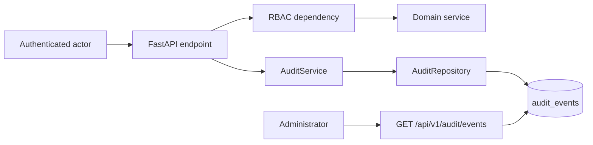

# Audit Trail

NexusOps AI includes an enterprise audit trail for sensitive platform actions. The goal is accountability and interview-ready production posture without adding unnecessary SaaS complexity.

## Architecture



## Captured Fields

Audit records include:

- Actor ID, email, and role.
- Action name.
- Timestamp.
- Resource type and resource ID.
- Status.
- Request ID.
- IP address.
- User agent.
- Metadata.

## Audited Actions

| Area | Example actions |
|---|---|
| Authentication | `auth.register`, `auth.login`, `auth.logout`, `auth.token_refresh` |
| Clusters | `cluster.register`, `cluster.update`, `cluster.delete`, `cluster.sync` |
| Demo workflows | `demo.infrastructure_generate`, `demo.telemetry_generate`, `demo.incidents_generate` |
| Incidents | `incident.create`, `incident.update`, `incident.resolve`, `incident.investigate` |
| Investigations | `investigation.create`, `investigation.run` |
| Terraform and security | `terraform.upload`, `terraform.analyze`, `security.terraform_scan` |
| Cost optimization | `optimization.analyze` |

## API Access

Administrators can query audit events through:

```text
GET /api/v1/audit/events
```

Supported filters include actor email, action, resource type, status, page, and page size.

## Operational Value

The audit model improves the project by demonstrating:

- Accountability for sensitive workflows.
- Security event logging.
- A dedicated repository/service pattern.
- A future path for compliance reporting.

## Recommended Enhancements

- Store failed login attempts outside request transaction rollbacks.
- Add immutable append-only storage for production compliance.
- Add audit export to SIEM or object storage.
- Add retention policies and integrity checks.
